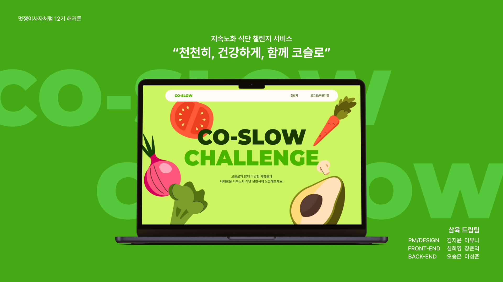

# 🐢 COSLOW  
### 가속노화를 늦추는 *저속노화 식단 챌린지 서비스*

---

## 📖 1. 서비스 개요

**COSLOW**는 MZ세대가 선호하는 ‘챌린지’ 문화를 기반으로  
일상 속에서 지속 가능한 **저속노화 식단 루틴**을 만들 수 있도록 돕는 헬스케어 서비스입니다.

---

## 🔍 2. 개발 배경

### ✨ 문제점: 잘못된 식습관으로 인한 ‘가속노화’

20·30대에서 당뇨와 고혈압 증가율이 부모 세대보다 높은 것으로 나타나면서  
‘가속노화’ 문제가 대두되고 있습니다.
이러한 가속노화의 주요 원인은 **잘못된 식습관**입니다.

---

## 🥗 3. 주요 기능

### ✔ 식단 챌린지 기능

COSLOW는 건강한 식습관 형성을 돕기 위해  
**챌린지 형태의 식단 관리 기능**을 제공합니다.

#### 다양한 챌린지 참여
- 코슬로에서 제공하는 기본 챌린지  
- 제휴 브랜드와 함께하는 챌린지  
- 유저가 직접 생성한 자발적 챌린지  

#### 챌린지 페이지에서 제공되는 정보
- 챌린지 기간  
- 참여 조건 및 설명  
- 참여 중인 유저 수   

---

## 🛠️ 4. 기술 스택 & 팀 구성

### 🔧 Backend — *오송은, 이성준*
- Spring Framework  
- Kakao Social Login

### 💻 Frontend — *심희영, 장준익*
- React

### 🎨 Design — *이유나, 김지윤*
- Figma

---

## 🚀 5. 결과물

- **배포 링크**: https://coslow-n1wllud5k-no4hs-projects.vercel.app/

---
